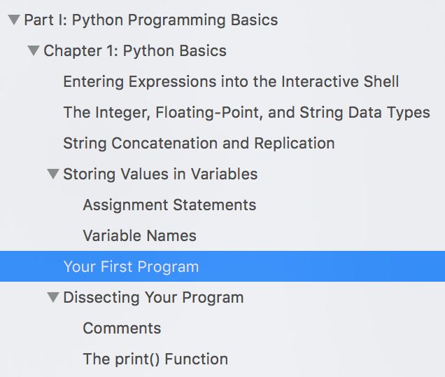
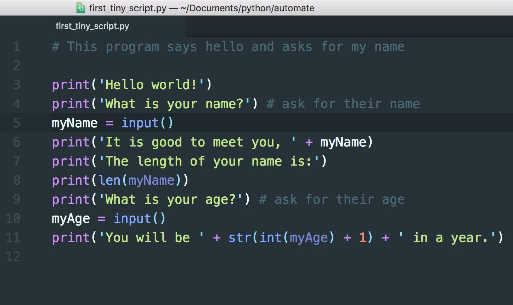
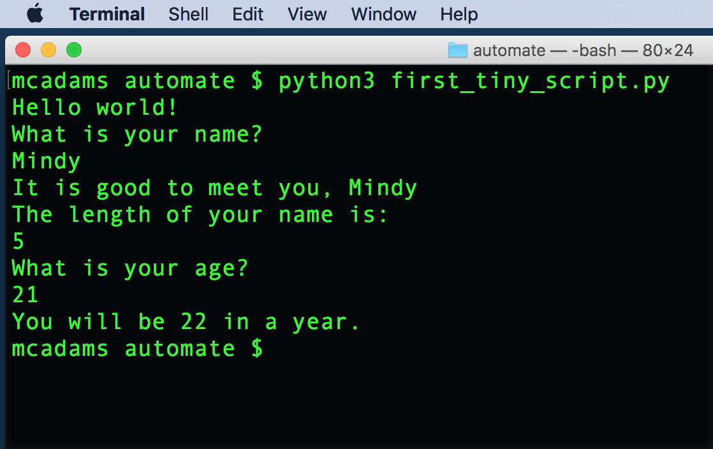

# Week 01

Students read chapters 1 and 2 in Sweigart. Some scripts in this folder are based on Sweigart’s &mdash; naturally, he has more examples than only these.

Until about halfway through chapter 1, Sweigart has us using the interactive Python interpreter. Then he switches to writing a program in a file, which he assumes we will run in IDLE. However, we write our code in [Atom](https://atom.io/) and run it in Terminal (or PowerShell on Windows).

## Python: Do not use IDLE

You can run any of the scripts in this folder in the manner described below.

In the middle of chapter 1 in Automate the Boring Stuff with Python, Sweigart invites you to leave the interactive Python shell (where you have the `>>>` prompt) and create a little program in a file.

Do not use IDLE. We are never using IDLE.

Instead, you can use Atom, our trusted code editor. Code is code. You can write any code in Atom. Instead of saving the file with a `.html` or `.js` extension, we save it with a `.py` extension when it is a Python file.

Then, how do you run it? Never try to run a file at the `>>>` prompt. You need to be at the bash prompt (`$`) in Terminal, or the PowerShell prompt if you’re using Windows.

It’s easiest if you are in the same directory where the `.py` file was saved. Use your `cd` command ([Command Line Tips](http://bit.ly/mm-commandline)) to get there. (I made a folder named `automate` for my files from the book.)

At the bash prompt, type this (using your actual filename, of course)

```python
python3 myfilename.py
```

And it runs!

Here’s where that comes in the chapter:



Here’s what the program looks like in Atom:



Here’s how I ran it in Terminal:


